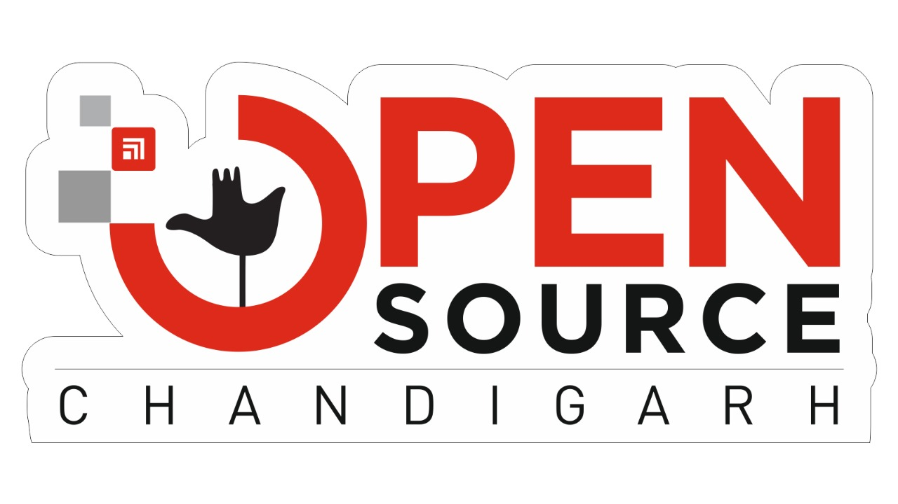

# Open Source Chandigarh 

  
  
  
  

# 🙋‍♀️ A Short Introduction - Who Are We?
<!------>
<!------>

> ### Open Source Chandigarh is a dynamic and vibrant tech community, powered by the intellectual powerhouse of Chitkara University. Our community thrives with the generous support of industry titans, including Apache Local Community Indore, Docker Inc., GitHub, Collabnix, OpsTree Solutions and Webiny.

<!---🌈 Contribution guidelines - how can the community get involved?
👩‍💻 Useful resources - where can the community find your docs? Is there anything else the community should know?
🍿 Fun facts - what does your team eat for breakfast?
🧙 Remember, you can do mighty things with the power of [Markdown](https://docs.github.com/github/writing-on-github/getting-started-with-writing-and-formatting-on-github/basic-writing-and-formatting-syntax)
--->
## 🌐 Socials:

  

# People 👤

       
  
  
  

  
  
      

        

          <a text="small" href="/orgs/Open-Source-Chandigarh/people" data-view-component="true" class="Link">
            View all
</a>
    

