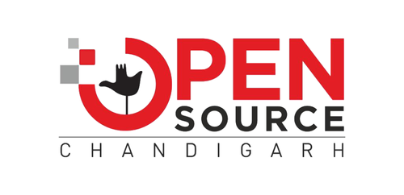

# Open Source Chandigarh 

  
  
  
  

# 🙋‍♀️ A Short Introduction - Who Are We?
<!------>
<!------>

> ### Open Source Chandigarh is a dynamic tech community committed to redefining the Open Source and technology ecosystem in Chandigarh, Punjab region and beyond. Established in 2022, the community has grown to over 5,000 members, fostering a strong culture of collaboration, learning and innovation.
>
> ### We actively operate a sub-community at Chitkara University, Punjab, known as Open Source Chandigarh powered by Chitkara University, where we empower students and tech enthusiasts through engaging and impactful initiatives.
>
> ### With 50+ events organized to date, including hackathons, hands-on workshops, expert talks, competitions, etc., we’ve created a thriving space for developers and learners alike. We've also built strong relationships through 20+ collaborations with various communities and organizations such as GitHub, Apache, Local Community Indore, Collabnix, Docker Inc., Opstree Solutions and Webiny.
> 
> ### Our mission is to foster open collaboration, support contributors at all levels and build a future-ready tech ecosystem grounded in the values of open source.
> 
> ### Driven by our motto — "Learn. Foster. Express. Because Open Source is Fun." — we strive to create a culture where every voice is valued, curiosity is encouraged and technology becomes a tool for change and innovation.

<!---🌈 Contribution guidelines - how can the community get involved?
👩‍💻 Useful resources - where can the community find your docs? Is there anything else the community should know?
🍿 Fun facts - what does your team eat for breakfast?
🧙 Remember, you can do mighty things with the power of [Markdown](https://docs.github.com/github/writing-on-github/getting-started-with-writing-and-formatting-on-github/basic-writing-and-formatting-syntax)
--->
## 🌐 Socials: (TO BE UPDATED)

  

## 🧑‍💻 Projects: (TO BE ADDED)
